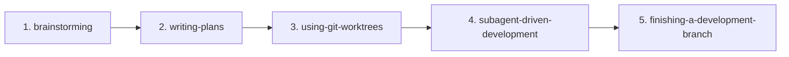

# Superpowers Windows 使用指南

> **为 Windows 开发者打造的完整教程** - 从安装到实战，5 分钟上手 AI 编程助手的高级技能库

---

## 📋 目录

- [什么是 Superpowers？](#什么是-superpowers)
- [快速开始（5 分钟）](#快速开始5-分钟)
- [前置要求](#前置要求)
- [详细安装步骤](#详细安装步骤)
  - [Claude Code 集成](#claude-code-集成)
  - [Codex 集成](#codex-集成)
- [核心技能介绍](#核心技能介绍)
- [标准开发工作流](#标准开发工作流)
- [实战示例](#实战示例)
- [Windows 特有问题与解决方案](#windows-特有问题与解决方案)
- [故障排查清单](#故障排查清单)
- [平台差异对比](#平台差异对比)
- [常见问题（FAQ）](#常见问题faq)
- [参考资源](#参考资源)

---

## 什么是 Superpowers？

**Superpowers** 是一套为 AI 编程助手（Claude Code、Codex、OpenCode）提供的高级技能库，包含：

- ✅ 经过实战验证的开发流程
- ✅ 最佳实践模板
- ✅ 系统化工作流
- ✅ 调试和规划工具

**为什么需要它？**

| 没有 Superpowers | 有 Superpowers |
|-----------------|----------------|
| AI 助手凭经验做事 | AI 遵循标准化流程 |
| 每次都要解释需求 | 使用 brainstorming 技能系统化澄清 |
| 调试全靠猜 | systematic-debugging 提供排查路径 |
| 计划不完整 | writing-plans 确保覆盖所有细节 |

---

## 快速开始（5 分钟）

### 最简安装（Claude Code）

打开 **PowerShell（管理员模式）**，复制粘贴以下命令：

```powershell
# 1. 克隆仓库
git clone https://github.com/obra/superpowers.git "$env:USERPROFILE\.claude\superpowers"

# 2. 创建目录
New-Item -ItemType Directory -Force -Path "$env:USERPROFILE\.claude\plugins"
New-Item -ItemType Directory -Force -Path "$env:USERPROFILE\.claude\skills"

# 3. 创建符号链接
New-Item -ItemType SymbolicLink -Path "$env:USERPROFILE\.claude\plugins\superpowers.js" -Target "$env:USERPROFILE\.claude\superpowers\.claude\plugins\superpowers.js"
New-Item -ItemType Junction -Path "$env:USERPROFILE\.claude\skills\superpowers" -Target "$env:USERPROFILE\.claude\superpowers\skills"
```

**验证安装**：
```powershell
# 检查文件是否存在
Test-Path "$env:USERPROFILE\.claude\plugins\superpowers.js"
Test-Path "$env:USERPROFILE\.claude\skills\superpowers"
```

如果两个命令都返回 `True`，安装成功！🎉

---

## 前置要求

### 必需环境

| 工具 | 版本要求 | 检查命令 | 安装方式 |
|------|---------|---------|---------|
| **Git** | 2.0+ | `git --version` | [git-scm.com](https://git-scm.com/download/win) |
| **PowerShell** | 5.1+ | `$PSVersionTable.PSVersion` | Windows 自带 |
| **Claude Code** 或 **Codex** | 最新版 | `claude --version` / `codex --version` | 官方安装程序 |

### 权限要求

⚠️ **Windows 符号链接需要以下任一条件：**

1. **开发者模式**（推荐）
   - 设置 → 更新和安全 → 开发者选项 → 开启"开发人员模式"
   
2. **管理员权限**
   - 右键 PowerShell → "以管理员身份运行"

3. **Git Bash 用户注意**
   - Git Bash 的 `ln -s` 在 Windows 上会**复制文件**而非创建符号链接
   - 必须使用 PowerShell 或 CMD

---

## 详细安装步骤

### Claude Code 集成

#### 方案一：完整安装（推荐）

**步骤 1：以管理员身份打开 PowerShell**

- 按 `Win + X`，选择"Windows PowerShell (管理员)"
- 或搜索"PowerShell"，右键选择"以管理员身份运行"

**步骤 2：克隆 Superpowers 仓库**

```powershell
git clone https://github.com/obra/superpowers.git "$env:USERPROFILE\.claude\superpowers"
```

**步骤 3：创建必需目录**

```powershell
New-Item -ItemType Directory -Force -Path "$env:USERPROFILE\.claude\plugins"
New-Item -ItemType Directory -Force -Path "$env:USERPROFILE\.claude\skills"
```

**步骤 4：清理旧链接（如存在）**

```powershell
Remove-Item "$env:USERPROFILE\.claude\plugins\superpowers.js" -Force -ErrorAction SilentlyContinue
Remove-Item "$env:USERPROFILE\.claude\skills\superpowers" -Force -ErrorAction SilentlyContinue
```

**步骤 5：创建符号链接**

```powershell
# 插件文件链接
New-Item -ItemType SymbolicLink -Path "$env:USERPROFILE\.claude\plugins\superpowers.js" -Target "$env:USERPROFILE\.claude\superpowers\.claude\plugins\superpowers.js"

# 技能目录链接（使用 Junction，兼容性更好）
New-Item -ItemType Junction -Path "$env:USERPROFILE\.claude\skills\superpowers" -Target "$env:USERPROFILE\.claude\superpowers\skills"
```

**步骤 6：验证安装**

```powershell
# 检查插件文件
Get-Item "$env:USERPROFILE\.claude\plugins\superpowers.js" | Select-Object LinkType, Target

# 检查技能目录
Get-Item "$env:USERPROFILE\.claude\skills\superpowers" | Select-Object LinkType, Target

# 列出可用技能
Get-ChildItem "$env:USERPROFILE\.claude\skills\superpowers" -Directory
```

**预期输出**：
```
LinkType     Target
--------     ------
SymbolicLink {C:\Users\你的用户名\.claude\superpowers\.claude\plugins\superpowers.js}

LinkType  Target
--------  ------
Junction  {C:\Users\你的用户名\.claude\superpowers\skills}
```

---

#### 方案二：无管理员权限安装

如果没有管理员权限，使用**目录复制**代替符号链接：

```powershell
# 克隆仓库
git clone https://github.com/obra/superpowers.git "$env:USERPROFILE\.claude\superpowers"

# 创建目录
New-Item -ItemType Directory -Force -Path "$env:USERPROFILE\.claude\plugins"
New-Item -ItemType Directory -Force -Path "$env:USERPROFILE\.claude\skills"

# 复制文件（不是链接！）
Copy-Item "$env:USERPROFILE\.claude\superpowers\.claude\plugins\superpowers.js" -Destination "$env:USERPROFILE\.claude\plugins\"
Copy-Item "$env:USERPROFILE\.claude\superpowers\skills" -Destination "$env:USERPROFILE\.claude\skills\superpowers" -Recurse
```

⚠️ **缺点**：更新 Superpowers 时需要重新复制文件

---

### Codex 集成

Codex 没有插件系统，但可以通过技能目录使用 Superpowers。

**完整安装步骤**：

```powershell
# 1. 克隆仓库
git clone https://github.com/obra/superpowers.git "$env:USERPROFILE\.codex\superpowers"

# 2. 创建技能目录
New-Item -ItemType Directory -Force -Path "$env:USERPROFILE\.agents\skills"

# 3. 清理旧链接
Remove-Item "$env:USERPROFILE\.agents\skills\superpowers" -Force -ErrorAction SilentlyContinue

# 4. 创建 Junction 链接
New-Item -ItemType Junction -Path "$env:USERPROFILE\.agents\skills\superpowers" -Target "$env:USERPROFILE\.codex\superpowers\skills"
```

**验证安装**：

```powershell
Get-ChildItem "$env:USERPROFILE\.agents\skills\superpowers" -Directory | Select-Object Name
```

**重要差异**：

| 特性 | Claude Code | Codex |
|------|-------------|-------|
| 插件系统 | ✅ 支持 | ❌ 不支持 |
| 自动注入 using-superpowers | ✅ 是 | ❌ 否 |
| 使用方式 | 自动加载 | 手动调用 Skill 工具 |

---

## 核心技能介绍

### 技能列表

| 技能名称 | 用途 | 使用场景 |
|---------|------|---------|
| **using-superpowers** | 基础框架，加载其他技能 | 每次会话开始时自动调用（Claude Code） |
| **brainstorming** | 需求澄清和设计 | 项目启动、需求不明确时 |
| **test-driven-development** | TDD 流程 | 编写新功能、重构代码 |
| **writing-plans** | 编写实施计划 | 复杂任务、多步骤开发 |
| **subagent-driven-development** | 子代理执行 | 并行任务、大型项目 |
| **systematic-debugging** | 系统化调试 | Bug 排查、性能问题 |
| **using-git-worktrees** | Git worktree 管理 | 并行开发多个分支 |

### 技能详解

#### 1. using-superpowers

**作用**：基础框架，加载所有其他技能

**Claude Code**：自动注入（通过插件）
**Codex**：需要手动调用

```bash
# Codex 中手动调用
/skill using-superpowers
```

---

#### 2. brainstorming

**用途**：系统化澄清需求和设计

**何时使用**：
- 项目刚开始，需求不明确
- 功能设计阶段
- 技术选型讨论

**示例提示词**：
```
我需要开发一个用户认证系统，帮我 brainstorming 一下
```

---

#### 3. test-driven-development

**用途**：遵循 TDD 流程开发

**流程**：
1. 写测试
2. 运行测试（失败）
3. 写代码
4. 运行测试（通过）
5. 重构

**示例**：
```
用 TDD 方式开发一个购物车功能
```

---

#### 4. writing-plans

**用途**：编写详细的实施计划

**输出内容**：
- 任务分解
- 技术方案
- 时间估算
- 风险评估

**示例**：
```
帮我写一个重构计划，将单体应用拆分为微服务
```

---

#### 5. systematic-debugging

**用途**：系统化排查问题

**排查步骤**：
1. 重现问题
2. 隔离问题范围
3. 收集日志和数据
4. 提出假设
5. 验证假设
6. 修复并验证

---

## 标准开发工作流

Superpowers 推荐的标准开发流程：



### 阶段详解

#### 阶段 1：brainstorming（需求澄清）

**目标**：明确做什么、为什么做、如何做

**活动**：
- 用户故事编写
- 技术方案讨论
- 风险识别

**输出**：需求文档、技术选型

---

#### 阶段 2：writing-plans（编写计划）

**目标**：制定详细的实施路线图

**活动**：
- 任务分解
- 工时估算
- 依赖关系梳理

**输出**：实施计划文档

---

#### 阶段 3：using-git-worktrees（分支管理）

**目标**：创建独立的工作环境

**好处**：
- 并行开发多个功能
- 隔离不同任务的上下文
- 快速切换工作环境

**示例**：
```bash
# 创建新 worktree
git worktree add ../my-feature feature-branch

# 在新目录工作
cd ../my-feature
```

---

#### 阶段 4：subagent-driven-development（执行开发）

**目标**：使用子代理并行执行任务

**适用场景**：
- 多个独立模块
- 需要不同专长的任务
- 大型重构项目

---

#### 阶段 5：finishing-a-development-branch（完成分支）

**目标**：合并代码、清理环境

**活动**：
- 代码审查
- 测试通过
- 合并到主分支
- 清理 worktree

---

## 实战示例

### 示例 1：从安装到运行第一个技能

**场景**：开发一个待办事项（TODO）应用

**步骤 1：安装 Superpowers**（已完成前面安装步骤）

**步骤 2：启动 Claude Code**

```bash
cd C:\Projects
mkdir todo-app
cd todo-app
claude
```

**步骤 3：使用 brainstorming 澄清需求**

输入提示词：
```
我需要开发一个命令行 TODO 应用，帮我 brainstorming 一下功能需求
```

AI 会引导你思考：
- 需要哪些核心功能？
- 数据如何存储？
- 命令行参数如何设计？

**步骤 4：使用 writing-plans 制定计划**

输入提示词：
```
基于刚才的 brainstorming，帮我写一个实施计划
```

**步骤 5：使用 TDD 开发**

输入提示词：
```
用 TDD 方式开发第一个功能：添加 TODO 项
```

---

### 示例 2：调试现有项目

**场景**：用户报告登录失败

**步骤 1：启动 systematic-debugging**

输入提示词：
```
用户反馈登录失败，帮我用 systematic-debugging 排查
```

**步骤 2：按照引导排查**

AI 会引导你：
1. 重现步骤
2. 检查日志
3. 隔离问题模块
4. 验证假设

---

### 示例 3：Codex 中使用 Superpowers

**重要**：Codex 没有插件系统，需要手动调用

**步骤 1：启动 Codex**

```bash
codex
```

**步骤 2：手动加载 using-superpowers**

```
/skill using-superpowers
```

**步骤 3：调用具体技能**

```
/skill brainstorming
我需要优化数据库查询性能
```

---

## Windows 特有问题与解决方案

### 问题 1：符号链接权限错误

**错误信息**：
```
New-Item : 你没有足够的权限执行此操作。
```

**解决方案 A：开启开发者模式**

1. 打开"设置"（Win + I）
2. 更新和安全 → 开发者选项
3. 开启"开发人员模式"
4. 重启 PowerShell

**解决方案 B：以管理员身份运行**

1. 右键 PowerShell
2. 选择"以管理员身份运行"
3. 重新执行安装命令

**解决方案 C：使用 Junction 代替**

```powershell
# 对目录使用 Junction（不需要特殊权限）
New-Item -ItemType Junction -Path "目标路径" -Target "源路径"
```

---

### 问题 2：用户名包含空格

**问题**：如用户名是 "Zhang San"，路径变成 `C:\Users\Zhang San\...`

**影响**：
- v4.3.0 之前版本会失败
- Git Bash 可能处理错误

**解决方案**：

1. **升级到 v4.3.0+**
   ```powershell
   cd "$env:USERPROFILE\.claude\superpowers"
   git pull
   ```

2. **使用引号包裹路径**
   ```powershell
   # 正确
   cd "$env:USERPROFILE\.claude\superpowers"
   
   # 错误
   cd $env:USERPROFILE\.claude\superpowers
   ```

---

### 问题 3：Git Bash 中 ln -s 失效

**问题**：Git Bash 的 `ln -s` 在 Windows 上会复制文件，不是创建符号链接

**错误示例**：
```bash
# Git Bash 中执行
ln -s source target  # 实际上复制了文件！
```

**解决方案**：使用 PowerShell 或 CMD

```powershell
# PowerShell
New-Item -ItemType SymbolicLink -Path "target" -Target "source"

# CMD
mklink "target" "source"
```

---

### 问题 4：SessionStart 钩子失败

**问题**：Claude Code 启动时钩子不执行

**原因**：Windows 不支持直接的 shell 脚本执行

**解决方案：使用 Polyglot Hook**

Superpowers 提供了跨平台的 `.cmd` 包装器：

1. **检查钩子文件**
   ```powershell
   ls "$env:USERPROFILE\.claude\superpowers\.claude\hooks\"
   ```

2. **确保使用 .cmd 包装器**
   - Polyglot 脚本同时包含 CMD 和 Bash 代码
   - CMD 执行上半部分
   - Unix shell 跳过 heredoc 执行下半部分

---

### 问题 5：路径分隔符问题

**问题**：Windows 使用 `\`，Linux/macOS 使用 `/`

**最佳实践**：

```powershell
# 推荐：使用 PowerShell 自动处理
Join-Path "$env:USERPROFILE" ".claude\plugins"

# 或使用 .NET 方法
[System.IO.Path]::Combine($env:USERPROFILE, ".claude", "plugins")

# 不推荐：硬编码路径
"C:\Users\用户名\.claude\plugins"  # 其他用户无法使用
```

---

## 故障排查清单

### 安装验证清单

```powershell
# 1. 检查仓库是否克隆成功
Test-Path "$env:USERPROFILE\.claude\superpowers"

# 2. 检查插件链接
Get-Item "$env:USERPROFILE\.claude\plugins\superpowers.js" | Select-Object LinkType, Target

# 3. 检查技能目录链接
Get-Item "$env:USERPROFILE\.claude\skills\superpowers" | Select-Object LinkType, Target

# 4. 列出所有技能
Get-ChildItem "$env:USERPROFILE\.claude\skills\superpowers" -Directory | Select-Object Name

# 5. 检查插件文件内容
Get-Content "$env:USERPROFILE\.claude\plugins\superpowers.js" -Head 5
```

### 常见问题排查

| 问题 | 检查命令 | 解决方案 |
|------|---------|---------|
| 链接失效 | `Get-Item ... \| Select-Object LinkType` | 重新创建链接 |
| 技能未加载 | `Get-ChildItem ... -Directory` | 检查目录权限 |
| Git 仓库未更新 | `cd ...; git status` | `git pull` |
| 权限错误 | `whoami /priv` | 启用开发者模式 |

### 日志查看

```powershell
# Claude Code 日志
Get-Content "$env:USERPROFILE\.claude\logs\*.log" -Tail 50

# 检查错误
Select-String -Path "$env:USERPROFILE\.claude\logs\*.log" -Pattern "error|failed"
```

---

## 平台差异对比

### 功能对比表

| 特性 | Windows | macOS | Linux |
|------|---------|-------|-------|
| **符号链接** | 需要管理员/开发者模式 | 原生支持 | 原生支持 |
| **路径分隔符** | `\` | `/` | `/` |
| **默认 Shell** | PowerShell/CMD | Bash/Zsh | Bash |
| **Git Bash 兼容性** | `ln -s` 失效 | 正常 | 正常 |
| **路径空格问题** | v4.3.0+ 已修复 | 无问题 | 无问题 |
| **SessionStart 钩子** | 需要 .cmd 包装 | 直接执行 | 直接执行 |

### 命令对比

| 操作 | Windows (PowerShell) | macOS/Linux (Bash) |
|------|---------------------|-------------------|
| **创建符号链接（文件）** | `New-Item -ItemType SymbolicLink -Path "目标" -Target "源"` | `ln -s 源 目标` |
| **创建目录链接** | `New-Item -ItemType Junction -Path "目标" -Target "源"` | `ln -s 源 目标` |
| **检查链接** | `Get-Item 目标 \| Select-Object LinkType` | `ls -l 目标` |
| **删除链接** | `Remove-Item 目标` | `rm 目标` |
| **用户目录** | `$env:USERPROFILE` | `$HOME` |

### 安装命令对比

**Claude Code 安装对比**：

```powershell
# Windows (PowerShell)
git clone https://github.com/obra/superpowers.git "$env:USERPROFILE\.claude\superpowers"
New-Item -ItemType SymbolicLink -Path "$env:USERPROFILE\.claude\plugins\superpowers.js" -Target "$env:USERPROFILE\.claude\superpowers\.claude\plugins\superpowers.js"
New-Item -ItemType Junction -Path "$env:USERPROFILE\.claude\skills\superpowers" -Target "$env:USERPROFILE\.claude\superpowers\skills"
```

```bash
# macOS/Linux (Bash)
git clone https://github.com/obra/superpowers.git ~/.claude/superpowers
ln -s ~/.claude/superpowers/.claude/plugins/superpowers.js ~/.claude/plugins/superpowers.js
ln -s ~/.claude/superpowers/skills ~/.claude/skills/superpowers
```

---

## 常见问题（FAQ）

### Q1：安装后 Claude Code 没有加载 Superpowers？

**A**：检查以下项：

1. 插件文件是否存在
   ```powershell
   Test-Path "$env:USERPROFILE\.claude\plugins\superpowers.js"
   ```

2. 技能目录是否存在
   ```powershell
   Test-Path "$env:USERPROFILE\.claude\skills\superpowers"
   ```

3. 重启 Claude Code

---

### Q2：如何更新 Superpowers？

**A**：
```powershell
cd "$env:USERPROFILE\.claude\superpowers"
git pull
```

如果使用复制方式安装（无管理员权限），需要重新复制文件。

---

### Q3：可以同时安装 Claude Code 和 Codex 版本吗？

**A**：可以，它们使用不同的目录：
- Claude Code: `~/.claude/superpowers`
- Codex: `~/.codex/superpowers`

---

### Q4：如何卸载？

**A**：
```powershell
# 删除链接
Remove-Item "$env:USERPROFILE\.claude\plugins\superpowers.js" -Force
Remove-Item "$env:USERPROFILE\.claude\skills\superpowers" -Force

# 删除仓库
Remove-Item "$env:USERPROFILE\.claude\superpowers" -Recurse -Force
```

---

### Q5：Codex 中如何自动加载 using-superpowers？

**A**：Codex 不支持插件系统，无法自动加载。建议：
- 创建别名或脚本
- 每次启动后手动执行 `/skill using-superpowers`

---

### Q6：为什么推荐使用 Junction 而不是 SymbolicLink？

**A**：
- **Junction**：不需要特殊权限，兼容性好
- **SymbolicLink**：需要管理员权限或开发者模式

对于目录链接，Junction 是更安全的选择。

---

### Q7：如何检查我是否在管理员模式？

**A**：
```powershell
# 方法 1
whoami /groups | findstr /i "S-1-16-12288"

# 方法 2
([Security.Principal.WindowsPrincipal] [Security.Principal.WindowsIdentity]::GetCurrent()).IsInRole([Security.Principal.WindowsBuiltInRole]::Administrator)
```

---

### Q8：安装失败如何回滚？

**A**：
```powershell
# 删除所有相关文件
Remove-Item "$env:USERPROFILE\.claude\superpowers" -Recurse -Force -ErrorAction SilentlyContinue
Remove-Item "$env:USERPROFILE\.claude\plugins\superpowers.js" -Force -ErrorAction SilentlyContinue
Remove-Item "$env:USERPROFILE\.claude\skills\superpowers" -Force -ErrorAction SilentlyContinue

# 重新开始安装
```

---

## 参考资源

### 官方资源

- **GitHub 仓库**：https://github.com/obra/superpowers
- **问题反馈**：https://github.com/obra/superpowers/issues
- **Claude Code 官网**：https://claude.ai/code

### 相关文档

- [Claude Code 文档](https://docs.anthropic.com/claude/docs)
- [Git for Windows](https://git-scm.com/download/win)
- [PowerShell 文档](https://docs.microsoft.com/powershell/)

### 社区资源

- **GitHub Discussions**：https://github.com/obra/superpowers/discussions
- **Discord 社区**：（如有）

---

## 版本历史

| 版本 | 日期 | 更新内容 |
|------|------|---------|
| v1.0 | 2026-03-16 | 初始版本，基于调研报告编写 |

---

## 贡献指南

发现错误或有改进建议？

1. 在 GitHub 上提交 Issue
2. 或直接提交 Pull Request

---

**祝你使用愉快！🚀**

如有问题，请查阅[故障排查清单](#故障排查清单)或在 GitHub 上提交 Issue。
